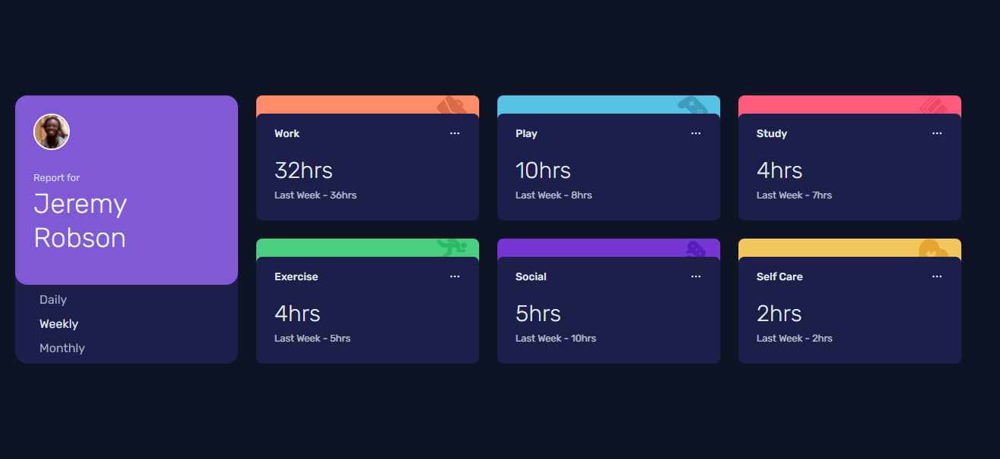
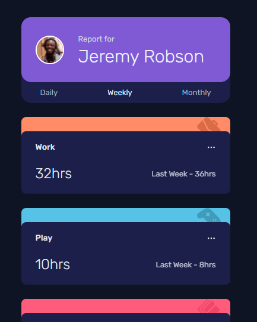

# Frontend Mentor - Time tracking dashboard solution

This is a solution to the [Time tracking dashboard challenge on Frontend Mentor](https://www.frontendmentor.io/challenges/time-tracking-dashboard-UIQ7167Jw). Frontend Mentor challenges help you improve your coding skills by building realistic projects.

## Table of contents

- Overview
  - [The challenge](#the-challenge)
  - [Screenshot](#screenshot)
  - [Links](#links)
- [My process](#my-process)
  - [Built with](#built-with)
  - [What I learned](#what-i-learned)
  - [Useful resources](#useful-resources)
- [Author](#author)

### The challenge

Users should be able to:

- View the optimal layout for the site depending on their device's screen size
- See hover states for all interactive elements on the page
- Switch between viewing Daily, Weekly, and Monthly stats

### Screenshot

### Links

- Solution URL: [Github](https://github.com/rahulkhimsuriya/frontendmentor-time-tracking-dashboard)
- Live Site URL: [Preview](https://frontendmentor-time-tracking-dashboard.vercel.app/)

## My process

1. get the design and start with just basic markup. don't think about how this element go there and there bla bla bla.
2. add (from Framework) or create css and think about which element goes where.
3. refactor with reusable componant **(i'm working with Framework)**

### Built with

- Mobile-first workflow
- [React](https://reactjs.org/) - JS library
- [Chakra UI](https://chakra-ui.com/) - Chakra UI framework

### What I learned

- I enjoyed working with [`Chakra UI`](https://chakra-ui.com/).
- it's so easy, if you know [`Tailwind CSS`](https://tailwindcss.com/) or familiar with any utility first css framework.
- my first choise was [`Evergreen`](https://evergreen.segment.com/), but there is no responsive support for that, for responsive you've to create classes and write media query, so i changed my mind.

### Useful resources

- [React JS](https://reactjs.org/)
- [Chara UI](https://tailwindcss.com/)
- [Tailwind CSS](https://tailwindcss.com/)
- [Evergreen](https://evergreen.segment.com/)
- [Docker](https://docs.docker.com/)

## Author

- Twitter - [@im\_\_rahulk](https://www.twitter.com/im__rahulk)
- Frontend Mentor - [@rahulkhimsuriya](https://www.frontendmentor.io/profile/rahulkhimsuriya)
